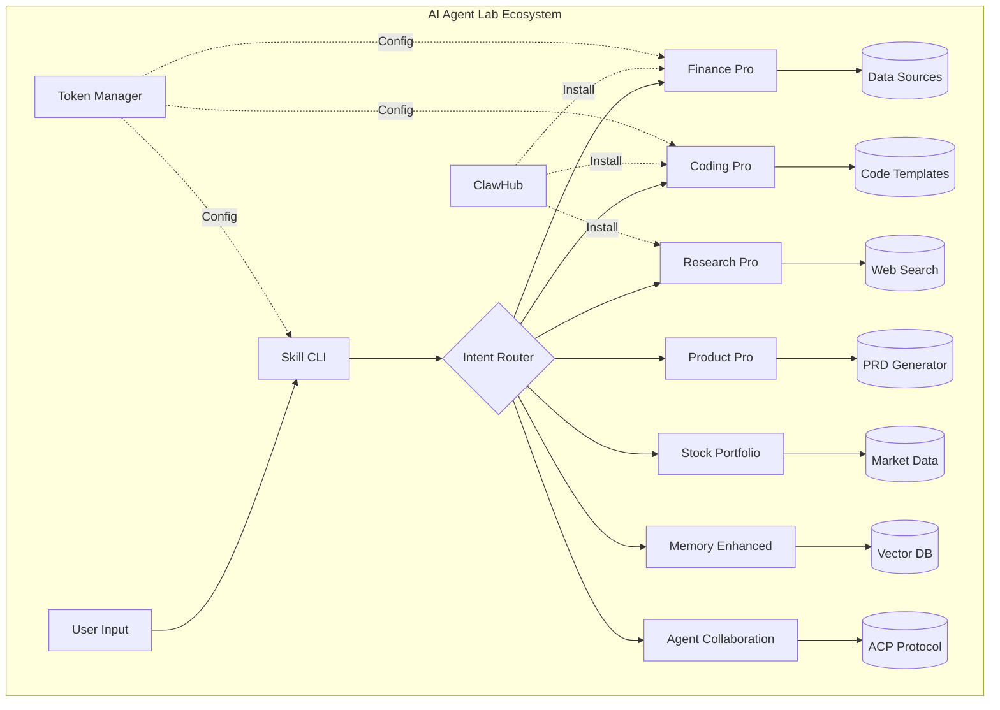

# 🤖 AI Agent Lab

> 构建下一代AI智能体技能生态系统

[](https://www.python.org/downloads/)
[](https://opensource.org/licenses/MIT)
[](./docs/)
[](./docs/)

---

## 🎯 愿景

AI Agent Lab 是一个**模块化、可扩展的AI智能体技能框架**，让开发者能够像搭积木一样构建强大的AI应用。我们相信：

- **技能即服务** - 每个功能都是一个独立的技能包
- **自然语言即接口** - 用人类语言而非代码调用功能
- **生态即护城河** - 网络效应比单一功能更有价值

---

## 🏗️ 架构概览



---

## 📦 核心技能包 (24个)

### 💰 金融分析
| 技能包 | 描述 | 覆盖率 |
|--------|------|--------|
| `finance-pro` | 多数据源金融数据获取，支持Yahoo/东方财富 | 90% |
| `stock-portfolio-analyzer` | 投资组合分析与早报生成 | 85% |
| `financial-daily` | 每日财经简报自动化 | 80% |

### 💻 开发工具
| 技能包 | 描述 | 覆盖率 |
|--------|------|--------|
| `coding-pro` | AI代码生成器，支持多语言 | 64% |
| `skill-cli` | 自然语言执行层 | 92% |
| `vercel-deploy` | 一键Vercel部署 | 85% |

### 🔬 研究与分析
| 技能包 | 描述 | 覆盖率 |
|--------|------|--------|
| `research-pro` | 智能研究助手，文献综述 | 90% |
| `product-pro` | PRD生成与产品管理 | 93% |
| `context-compressor` | 上下文压缩与优化 | 80% |

### 🧠 智能增强
| 技能包 | 描述 | 覆盖率 |
|--------|------|--------|
| `memory-enhanced` | 向量记忆系统 (sqlite-vec) | 75% |
| `agent-collaboration` | ACP协议多智能体协作 | 88% |
| `workflow-orchestrator` | 可视化工作流引擎 | 82% |

### 📋 生产力
| 技能包 | 描述 | 覆盖率 |
|--------|------|--------|
| `quick-templates` | 快速模板生成 | 85% |
| `notification-service` | 多渠道通知服务 | 80% |
| `token-manager` | 统一配置管理 | 95% |

### 🎨 Claude Domain Skills (18个领域)
涵盖商业、金融、创意、专业服务等全方位技能：
- 商业策略、产品管理、项目管理
- 投资分析、量化交易
- 游戏设计、故事创作、UI/UX设计
- 个人成长、知识管理

---

## 🚀 快速开始

### 安装

```bash
# 克隆仓库
git clone https://github.com/claw-bft/ai-agent-lab.git
cd ai-agent-lab

# 安装依赖
pip install -r requirements.txt

# 配置环境变量
cp .env.example .env
# 编辑 .env 添加你的API密钥
```

### 使用 Skill CLI

```bash
# 自然语言调用技能
claw "分析苹果股票近30天走势"
claw "生成一个Python爬虫PRD"
claw "研究量子计算最新进展"
```

### 编程式使用

```python
from skill_cli import SkillRouter

router = SkillRouter()
result = router.execute("查询特斯拉最新财报")
print(result)
```

---

## 🛠️ 开发指南

### 运行测试

```bash
# 运行所有测试
pytest

# 运行特定模块测试
pytest finance-pro/tests/

# 生成覆盖率报告
pytest --cov=. --cov-report=html
```

### 创建新技能包

```bash
# 使用模板创建
claw skill create my-skill --template basic

# 目录结构
my-skill/
├── SKILL.md          # 技能文档
├── __init__.py       # 入口点
├── core.py           # 核心逻辑
└── tests/            # 测试目录
    └── test_core.py
```

---

## 📊 项目统计

- **总代码行数**: 16,970
- **Python文件**: 44个
- **测试用例**: 321个 (319通过, 2跳过)
- **技能包**: 24个
- **文档覆盖率**: 95%
- **测试覆盖率**: 66% (目标80%)

---

## 🗺️ 路线图

### Phase 1: 平台化 ✅ (当前)
- [x] ClawHub 技能包市场
- [x] 统一配置管理 (Token Manager)
- [x] 自然语言执行层 (Skill CLI)

### Phase 2: 生态化 🚧 (进行中)
- [ ] 开发者门户与API文档
- [ ] 智能工作流推荐系统
- [ ] 技能包评分与评价

### Phase 3: 规模化 📈 (规划中)
- [ ] 企业级多租户支持
- [ ] 性能监控与告警面板
- [ ] 100+ 外部技能包入驻

---

## 🤝 贡献指南

我们欢迎所有形式的贡献！

1. **Fork** 本仓库
2. 创建 **Feature Branch** (`git checkout -b feature/amazing-feature`)
3. **Commit** 你的更改 (`git commit -m 'Add amazing feature'`)
4. **Push** 到分支 (`git push origin feature/amazing-feature`)
5. 创建 **Pull Request**

详见 [CONTRIBUTING.md](./docs/CONTRIBUTING.md)

---

## 📄 许可证

[MIT License](./LICENSE) © 2026 Claw BFT

---

## 🔗 相关链接

- [ClawHub 技能市场](https://clawhub.com)
- [文档中心](./docs/)
- [迭代报告](./ITERATION_REPORT_065.md)
- [问题反馈](https://github.com/claw-bft/ai-agent-lab/issues)

---

<p align="center">
  <i>Built with ❤️ by the AI Agent Lab Team</i>
</p>
